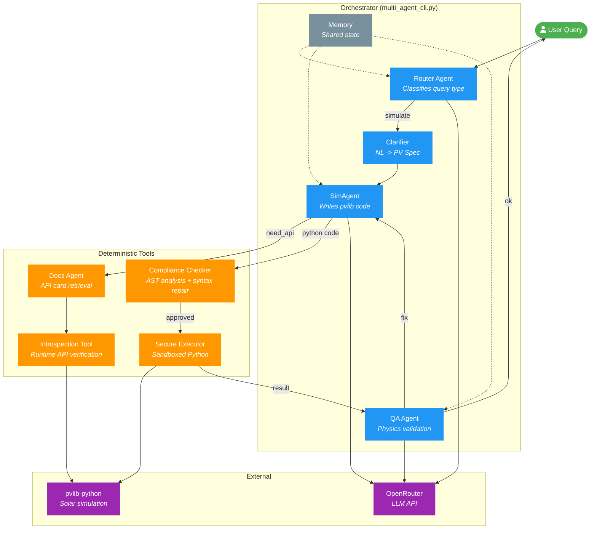

<div align="center">

# Helio

### AI-Powered Solar PV Simulation Companion

**Ask questions in plain English. Get validated pvlib simulations.**

[Getting Started](#getting-started) &#8226; [How It Works](#how-it-works) &#8226; [Examples](#what-can-you-ask) &#8226; [Architecture](#architecture) &#8226; [Contributing](#feedback--contributing)

<br>

<video src="demo.mp4" controls="controls" style="max-width: 100%;">
</video>

<sub>*A real Helio session -- from question to validated result in seconds.*</sub>

</div>

<br>

## What is Helio?

Helio is a multi-agent AI system that turns natural language questions into real solar PV simulations. Under the hood, it writes [pvlib-python](https://pvlib-python.readthedocs.io/) code, runs it in a secure sandbox, validates the physics, and explains the results back to you.

No Python knowledge required. Just ask.

```
Helio> What's the annual energy for a 10 kW rooftop system in Sydney?

   Running simulation...
   Location: Sydney (-33.87, 151.21)
   System: 10 kW DC, 30 deg tilt, north-facing
   Model: PVWatts + Ineichen clear-sky

   Result: 14,520 kWh/year
   Capacity factor: 0.166
   Peak AC: 8,740 W
```

<br>

---

## Getting Started

### 1. Get an OpenRouter API Key

Helio uses [OpenRouter](https://openrouter.ai/) to access LLMs. It takes 30 seconds to set up:

1. Go to **[openrouter.ai](https://openrouter.ai/)** and sign up (Google / GitHub / email)
2. **Add credit:** Go to **[Account > Credits](https://openrouter.ai/settings/credits)** and add a small prepaid amount (e.g. **$2**). OpenRouter is prepaid -- you will never be charged more than what you put in.
3. **Set a limit:** Go to **[Account > Limits](https://openrouter.ai/settings/limits)** and set a credit limit matching your top-up (e.g. **$2**). This is a hard cap -- Helio will only ever spend what you've explicitly allowed.
4. Navigate to **[Keys](https://openrouter.ai/keys)** and click **"Create Key"**
5. Copy the key (starts with `sk-or-v1-...`)

> **Cost:** A typical Helio session (20-30 queries) costs roughly **$0.02 - $0.10** depending on the model. The default model (`anthropic/claude-sonnet-4.5`) runs about $0.003 per query. A $2 top-up is enough for hundreds of queries.

### 2. Install

```bash
# Clone the repo
git clone https://github.com/fiacrerougieux/helio-public-minimal.git
cd helio-public-minimal

# Install dependencies
pip install -e .
```

### 3. Set Your API Key

**Linux / macOS:**
```bash
export OPENROUTER_API_KEY="sk-or-v1-your-key-here"
```

**Windows (Command Prompt):**
```cmd
setx OPENROUTER_API_KEY "sk-or-v1-your-key-here"
```

**Or create a `.env` file** in the project root:
```
OPENROUTER_API_KEY=sk-or-v1-your-key-here
```

### 4. Launch

```bash
python helio.py
```

You'll see:
```
 _   _      _ _
| | | | ___| (_) ___
| |_| |/ _ \ | |/ _ \
|  _  |  __/ | | (_) |
|_| |_|\___|_|_|\___/

Helio -- AI Companion for Solar PV Simulation

Helio>
```

Type a question and press Enter. That's it.

<br>

---

## What Can You Ask?

Helio understands a wide range of solar PV questions:

| Category | Example Query |
|----------|--------------|
| **Annual energy** | *"What's the annual output for a 10 kW system in Tokyo?"* |
| **Tilt optimization** | *"Compare tilt angles 20, 30, and 40 degrees in Madrid"* |
| **Tracking systems** | *"Compare single-axis tracking vs fixed tilt in Phoenix"* |
| **Inverter clipping** | *"What's the clipping loss for 10 kW DC / 8 kW AC?"* |
| **Temperature effects** | *"How does temperature affect output in Dubai vs Sydney?"* |
| **Irradiance models** | *"Compare Perez vs Hay-Davies transposition for Melbourne"* |
| **Monthly profiles** | *"Show monthly energy production for London"* |
| **Location comparison** | *"Compare annual yield: Sydney vs Berlin vs Nairobi"* |

<br>

---

## How It Works

When you type a question, Helio doesn't just call a single AI model. It runs a **pipeline of specialized agents** that each handle one part of the problem:

```
 You ask a question
        |
        v
 +--------------+
 |    Router     |   Classifies your query (annual yield? comparison? tracker study?)
 +--------------+
        |
        v
 +--------------+
 |  Docs Agent   |   Retrieves real pvlib function signatures via runtime introspection
 +--------------+
        |
        v
 +--------------+
 |   SimAgent    |   Writes Python/pvlib code using verified API signatures
 +--------------+
        |
        v
 +--------------+
 |  Compliance   |   Static analysis: blocks dangerous code, validates imports
 +--------------+
        |
        v
 +--------------+
 |   Executor    |   Runs code in a secure sandbox (OS-level isolation)
 +--------------+
        |
        v
 +--------------+
 |   QA Agent    |   Checks physics plausibility and result completeness
 +--------------+
        |
        v
  Answer (with explanation)
```

If the QA Agent finds a problem (wrong time period, physics violation, API error), it sends feedback to SimAgent and the loop retries -- up to 5 iterations. If it keeps failing, a **fallback ladder** kicks in, simplifying the simulation approach until something works.

<br>

---

## Architecture

### Agent Map



### What Each Agent Does

| Agent | Type | Role |
|-------|------|------|
| **Router** | LLM | Classifies the query (annual yield, comparison, tracker study, etc.) and decides the execution path |
| **Clarifier** | LLM | Converts natural language into a structured PV specification (location, system size, tilt, azimuth) |
| **SimAgent** | LLM | Writes Python code using pvlib, guided by real API signatures from the Docs Agent |
| **QA Agent** | LLM | Validates results against physics bounds (capacity factor, peak power, energy ranges) |
| **Docs Agent** | Deterministic | Retrieves runtime-verified function signatures (APICards) so the LLM never guesses parameter names |
| **Compliance** | Deterministic | AST-based static analysis -- blocks dangerous imports, validates API usage, auto-repairs syntax |
| **Executor** | Deterministic | Runs code in an OS-level sandbox (Bubblewrap on Linux, sandbox-exec on macOS, process isolation on Windows) |
| **Memory** | Deterministic | Tracks conversation state, error history, and fallback level across iterations |

### Fallback Ladder

If the detailed simulation fails, Helio doesn't just give up. It automatically simplifies:

```
Level 1: Full pvlib (transposition + temperature models + clearsky)
   |
   | fails? try simpler...
   v
Level 2: PVWatts simplified (GHI only, no transposition)
   |
   | fails? try simpler...
   v
Level 3: Constant irradiance (pure Python, latitude-based estimate)
   |
   | fails? report the error
   v
Level 4: Graceful error message with explanation
```

<br>

---

## Security

Helio executes LLM-generated code. That's inherently risky, so it uses three layers of protection:

| Layer | What It Does |
|-------|-------------|
| **Pre-execution** | AST analysis blocks `eval`, `exec`, `__import__`, file I/O, network calls. Only `pvlib`, `pandas`, `numpy`, `scipy`, and `json` imports are allowed. |
| **Runtime sandbox** | Code runs in OS-level isolation: **Bubblewrap** (Linux), **sandbox-exec** (macOS), or **process isolation** (Windows). No filesystem or network access from inside the sandbox. |
| **Post-execution** | QA Agent validates physics plausibility. Output size limits and timeouts prevent resource abuse. |

<br>

---

## Project Structure

```
helio/
|-- agent/                     # Core multi-agent system
|   |-- multi_agent_cli.py     # Main entry point & orchestrator
|   |-- multi_agent_prompts.py # System prompts (Router, SimAgent, QA)
|   |-- openrouter_client.py   # LLM API client
|   |-- docs_agent.py          # API documentation retrieval
|   |-- clarifier.py           # Natural language -> PV spec
|   |-- executor.py            # Python executor with AST security
|   |-- secure_executor.py     # OS-level sandbox wrapper
|   |-- memory_orchestrator.py # Shared state & fallback ladder
|   |-- handoff_schemas.py     # Pydantic contracts between agents
|   |-- tools/
|   |   |-- introspection.py   # Runtime pvlib API verification
|   |   +-- compliance.py      # Code compliance & syntax repair
|   +-- schemas/
|       |-- api_cards.py       # API signature data model
|       +-- pv_spec_schema.py  # Canonical PV specification
|
|-- eval/                      # Evaluation framework
|   |-- run_eval.py            # Automated eval harness
|   |-- metrics.py             # Physics validators & scoring
|   +-- tasks/                 # 10 benchmark tasks (JSON)
|
|-- tests/                     # Test suite
|   |-- stress_test_hard_mode.py  # 40-query hard-mode stress tests
|   |-- compare_models.py        # Cross-model comparison harness
|   +-- ...                      # Unit & integration tests
|
|-- docs/                      # Documentation
|-- scripts/                   # Setup utilities
+-- sim_runtime/               # Isolated pvlib virtual environment
```

<br>

---

## Configuration

### Change the LLM Model

Default model: `anthropic/claude-sonnet-4.5`

```bash
# Use a different model
python helio.py --model openai/gpt-4o-mini

# Or the latest Gemini
python helio.py --model google/gemini-2.5-flash
```

Any model available on [OpenRouter](https://openrouter.ai/models) works. We've tested extensively with:

| Model | Pass Rate (E2E) | Cost/Query | Notes |
|-------|-----------------|-----------|-------|
| `anthropic/claude-sonnet-4.5` | **100%** (7/7) | ~$0.003 | Default -- most reliable |
| `openai/gpt-4o-mini` | 86% (6/7) | ~$0.001 | Fast and cheap |
| `google/gemini-2.5-flash` | 100% (7/7) | ~$0.001 | Excellent value |

### CLI Options

```bash
python helio.py \
  --model anthropic/claude-sonnet-4.5 \  # LLM model
  --temperature 0.0 \                     # Deterministic output
  --debug \                               # Verbose logging
  --use-clarifier \                       # Enable input disambiguation
  --use-planner                           # Enable task decomposition
```

<br>

---

## Troubleshooting

<details>
<summary><b>"Cannot connect to OpenRouter"</b></summary>

Check your API key is set:
```bash
# Linux/macOS
echo $OPENROUTER_API_KEY

# Windows
echo %OPENROUTER_API_KEY%
```

If empty, set it again (see [Getting Started](#1-get-an-openrouter-api-key)).

</details>

<details>
<summary><b>"ImportError: attempted relative import"</b></summary>

Always run as a module:
```bash
python helio.py    # correct
python agent/multi_agent_cli.py    # wrong
```

</details>

<details>
<summary><b>Slow first query</b></summary>

The first query takes longer because Helio pre-loads 30 pvlib API signatures via runtime introspection. Subsequent queries are faster.

</details>

<details>
<summary><b>Simulation returns unexpected results</b></summary>

Try enabling the clarifier for more precise input parsing:
```bash
python helio.py --use-clarifier
```

</details>

<br>

---

## What's Next

Helio is under active development. We're working on integrating more of the open-source solar PV ecosystem as tools:

| Library | Domain | What It Adds |
|---------|--------|-------------|
| **[pvlib-python](https://github.com/pvlib/pvlib-python)** | General PV modelling | End-to-end performance modelling (solar position, irradiance, DC/AC). Already integrated. |
| **[rdtools](https://github.com/NREL/rdtools)** | Degradation & soiling | Reproducible time-series analysis: degradation rates, soiling loss quantification |
| **[pvanalytics](https://github.com/pvlib/pvanalytics)** | Data QA/QC | Filtering, outlier detection, and feature labelling for PV system data |
| **[PVMismatch](https://github.com/SunPower/PVMismatch)** | Electrical detail | Explicit IV/PV curve tracing and mismatch modelling (cell to system) |
| **[bifacial_radiance](https://github.com/NREL/bifacial_radiance)** | Bifacial & ray-tracing | RADIANCE-based bifacial irradiance and performance modelling |
| **[pvfactors](https://github.com/SunPower/pvfactors)** / **[solarfactors](https://github.com/pvlib/solarfactors)** | Shading & view-factors | 2D view-factor model for diffuse shading and bifacial irradiance |
| **[PySAM](https://github.com/NREL/pysam)** | Techno-economic | Python wrapper around SAM/SSC (performance + financial modelling) |
| **[reV](https://github.com/NREL/reV)** | Geospatial potential | Regional techno-economic potential and supply-curve modelling |

We're also adding:

- Weather data integration (TMY, PVGIS, NSRDB) with automatic fallback
- Richer output formats (plots, CSV export, PDF reports)
- Local model support (Ollama) for fully offline operation
- Interactive mode with follow-up questions and session memory

<br>

---

## Feedback & Contributing

This is an open-source research project and **we'd love your feedback**.

- **Found a bug?** [Open an issue](https://github.com/fiacrerougieux/helio-public-minimal/issues)
- **Have an idea?** [Start a discussion](https://github.com/fiacrerougieux/helio-public-minimal/discussions)
- **Want to contribute?** PRs are welcome -- see the [project structure](#project-structure) to get oriented

Areas where contributions would be particularly valuable:
- Adding new pvlib simulation capabilities
- Improving physics validation rules
- Testing with different LLM models
- Better error messages and user experience

<br>

---

## Credits

- **[pvlib-python](https://pvlib-python.readthedocs.io/)** -- The solar simulation engine that powers everything
- **[OpenRouter](https://openrouter.ai/)** -- LLM API gateway
- **[Pydantic](https://docs.pydantic.dev/)** -- Type-safe agent contracts
- **[Rich](https://rich.readthedocs.io/)** -- Terminal formatting

<br>

---

<div align="center">

**Helio** -- AI Companion for Solar PV Simulation

MIT License

Built for the solar community.

</div>
